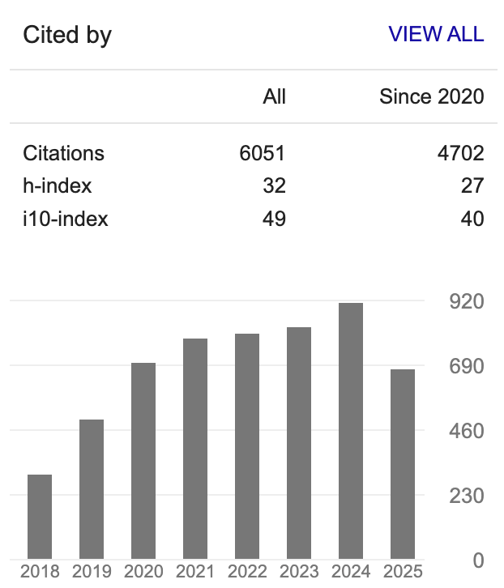
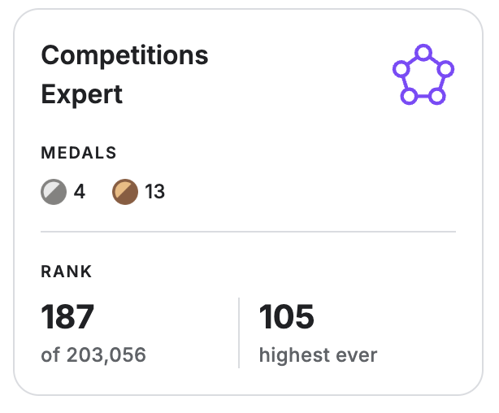

### Hi there, this is Inkyu 👋
---
My interests are Field Robotics, Applied machine learning, Large-language models, and AI-generated content (AIGC e.g., stable-diffusion).

### Highlight repos & projects
* [3D object retrival tutorial](https://github.com/inkyusa/3D_object_retrieval): a toy example for 3D model retreival either from text or image, both using CLIP embedding and FAISS indexing
* [GenAI game scene generation](https://inkyusa.itch.io/low-poly-ai-generated-mid-age): Unity + 3D object retrival + diffuser + mono depth estimation demo (no code base available, but only sample playing)
* [deepNIR](https://inkyusa.github.io/deepNIR_dataset/): Dataset for generating synthetic NIR images and improved fruit detection system using deep learning techniques
* [Fork of Imitation learning algorithms and co-training for Mobile ALOHA](https://github.com/inkyusa/act_vel_added): many bug fixes, velocity feature added, more script for training, validation, and visualisation
* [weedNet](https://github.com/inkyusa/weedNet): Multispectral crop&weed dataset for semantic segmentation
* [deepFruits](https://www.kaggle.com/datasets/enddl22/deepnir-11fruits): Kaggle hosted, 11 fruits bounding box annoration datasets
* [gym rotors](https://github.com/inkyusa/gym_rotor): Old (6yrs) but contains the fundamental toy examples for continuous RL control for a quadrotor
  
### [My Google Scholar Citations](https://scholar.google.com.au/citations?user=KxJU37kAAAAJ&hl=en)

  

(updated on Nov/7/2025)

  

### My Kaggle profile
---
Kaggle is one of my favourite places to learn and explore new machine learning (ML) technologies. I have found it to be a fun and entertaining playground where I can apply my skills and knowledge to real-world problems.

If you are also interested in ML or other state-of-the-art (SOTA) technologies, I highly recommend checking out Kaggle. There are a wide range of challenging problems that need to be solved, and Kaggle provides a great platform for learning and collaboration.

  

(187/203,065 as of July/17/2025, Top 0.05%)

Here is my Kaggle profile page: [My Kaggle profile](https://www.kaggle.com/enddl22)

<!-- 

 -->
 
I hope you enjoy Kaggle as much as I do!

### Github stats
---

&nbsp;

<!--

  

-->

<!--
**inkyusa/inkyusa** is a ✨ _special_ ✨ repository because its `README.md` (this file) appears on your GitHub profile.

Here are some ideas to get you started:

- 🔭 I’m currently working on ...
- 🌱 I’m currently learning ...
- 👯 I’m looking to collaborate on ...
- 🤔 I’m looking for help with ...
- 💬 Ask me about ...
- 📫 How to reach me: ...
- 😄 Pronouns: ...
- ⚡ Fun fact: ...
-->

