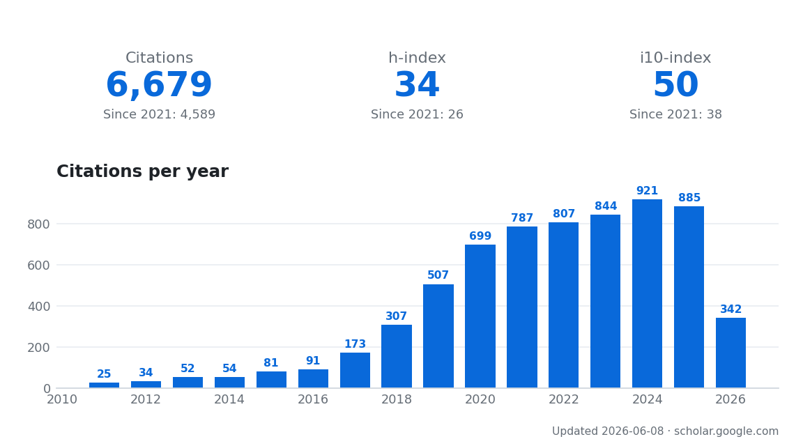
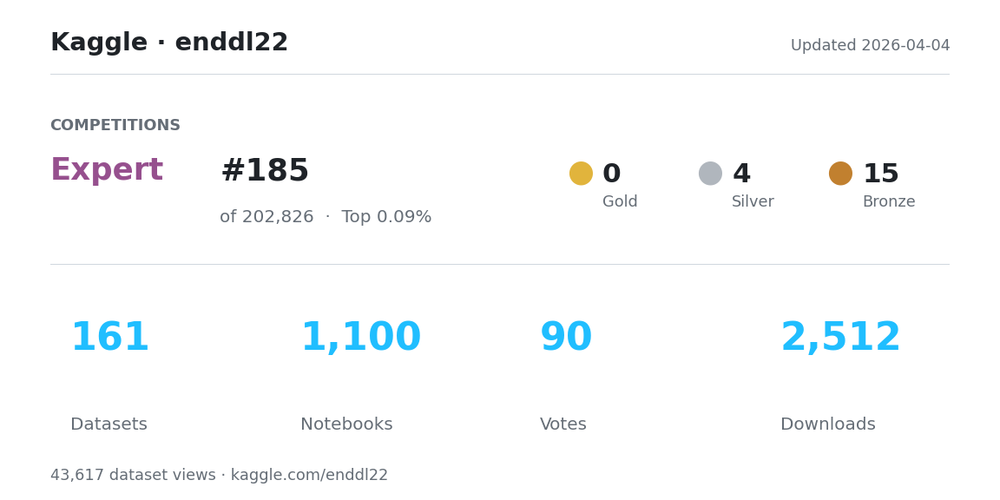
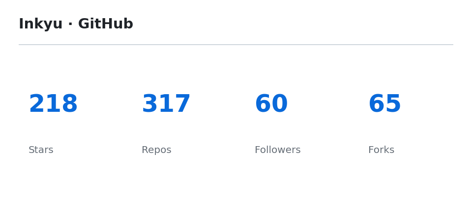
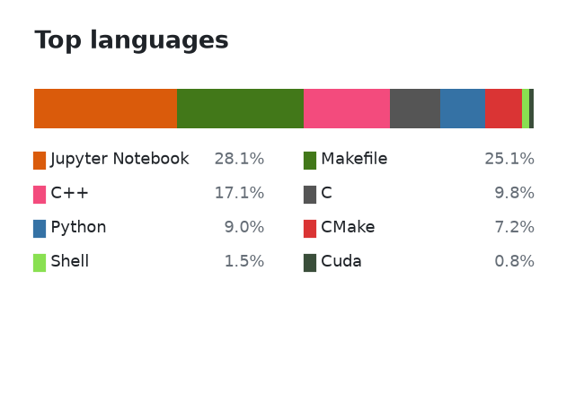

<h1 align="center">Hi, I'm Inkyu 👋</h1>

  Field Robotics &nbsp;·&nbsp; Applied Machine Learning &nbsp;·&nbsp; LLMs &nbsp;·&nbsp; AI-Generated Content

  
  
  
  
  

---

### 🧭 About

I build systems at the intersection of **robotics**, **computer vision**, and **modern AI** — from multispectral crop/weed segmentation in the field, to 3D retrieval with CLIP + FAISS, to diffusion-based game content and imitation learning for Mobile ALOHA. I enjoy turning research prototypes into things that actually run.

---

### 📚 Google Scholar — Live Citations

  <picture>
    <source media="(prefers-color-scheme: dark)" srcset="./assets/scholar_dark.png">
    
  </picture>

Auto-refreshed weekly from <a href="https://scholar.google.com.au/citations?user=KxJU37kAAAAJ&hl=en">Google Scholar</a> via SerpAPI.

---

### 🏆 Kaggle Profile

  <picture>
    <source media="(prefers-color-scheme: dark)" srcset="./assets/kaggle_dark.png">
    
  </picture>

  <picture>
    <source media="(prefers-color-scheme: dark)" srcset="https://road-to-kaggle-grandmaster.vercel.app/api/badges/enddl22/competitions">
    
  </picture>

Auto-refreshed weekly from the Kaggle API.

Kaggle is one of my favourite playgrounds for exploring new ML ideas on real-world data. Full profile → [kaggle.com/enddl22](https://www.kaggle.com/enddl22).

---

### 🚀 Featured Projects

| Project | Description |
| --- | --- |
| [**3D object retrieval tutorial**](https://github.com/inkyusa/3D_object_retrieval) | Toy example for 3D model retrieval from text or image using CLIP embeddings + FAISS indexing. |
| [**GenAI game scene generation**](https://inkyusa.itch.io/low-poly-ai-generated-mid-age) | Unity + 3D retrieval + diffusion + monocular depth estimation demo (playable sample). |
| [**deepNIR**](https://inkyusa.github.io/deepNIR_dataset/) | Synthetic NIR image generation + improved fruit detection with deep learning. |
| [**Mobile ALOHA (fork)**](https://github.com/inkyusa/act_vel_added) | Imitation learning + co-training for Mobile ALOHA — bug fixes, velocity feature, extra tooling. |
| [**weedNet**](https://github.com/inkyusa/weedNet) | Multispectral crop & weed dataset for semantic segmentation. |
| [**deepFruits**](https://www.kaggle.com/datasets/enddl22/deepnir-11fruits) | Kaggle-hosted 11-fruits bounding-box annotation dataset. |
| [**gym_rotor**](https://github.com/inkyusa/gym_rotor) | Foundational continuous-control RL examples for quadrotors. |

---

### 🛠️ Tech Stack

  
  
  
  
  
  
  
  
  
  
  
  

---

### 📊 GitHub Stats

  <picture>
    <source media="(prefers-color-scheme: dark)" srcset="./assets/github_stats_dark.png">
    
  </picture>

  <picture>
    <source media="(prefers-color-scheme: dark)" srcset="./assets/github_langs_dark.png">
    
  </picture>

  <picture>
    <source media="(prefers-color-scheme: dark)" srcset="https://streak-stats.demolab.com/?user=inkyusa&theme=github-dark&hide_border=true">
    
  </picture>

